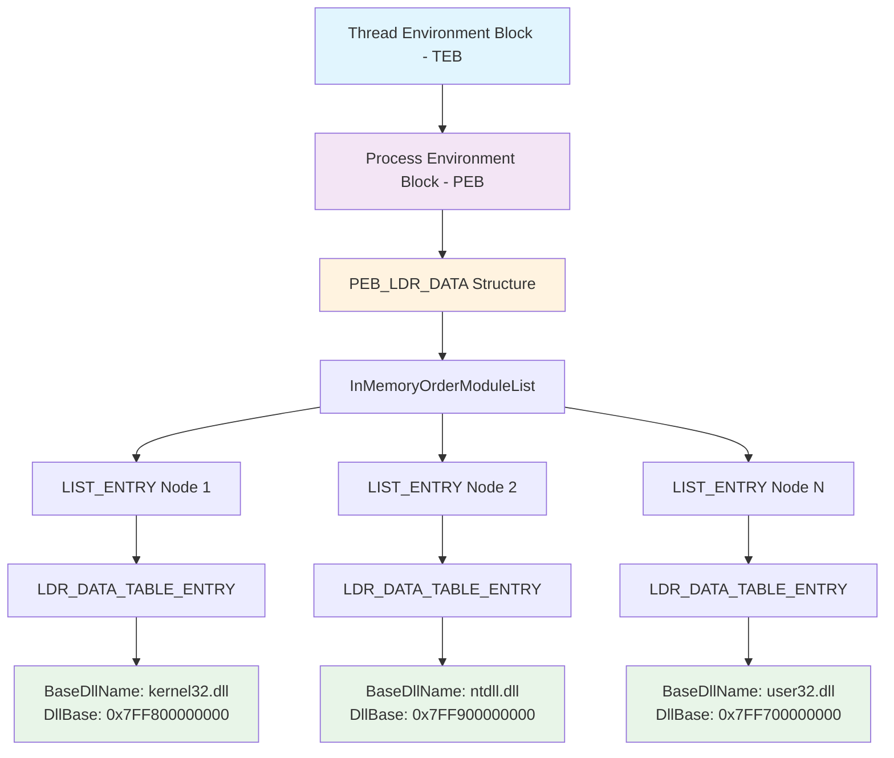
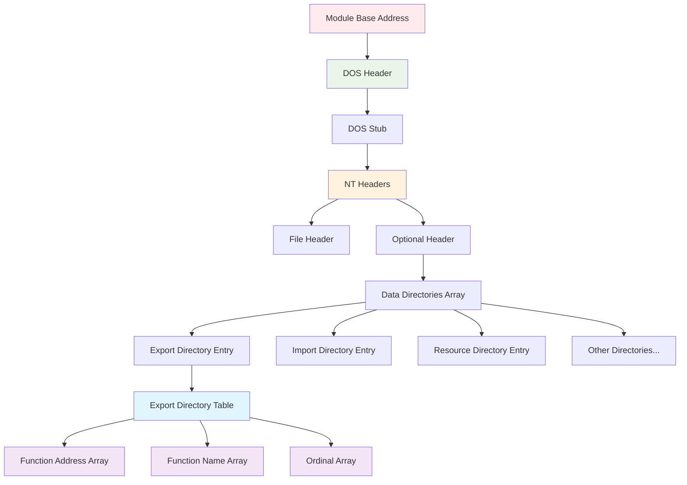
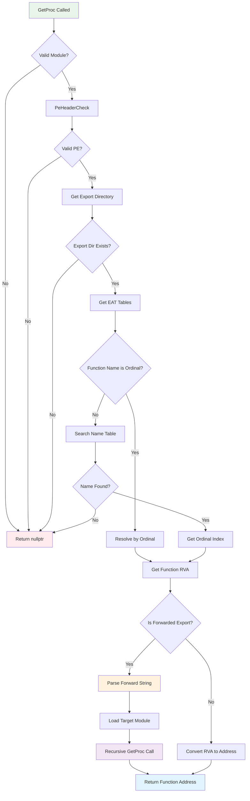
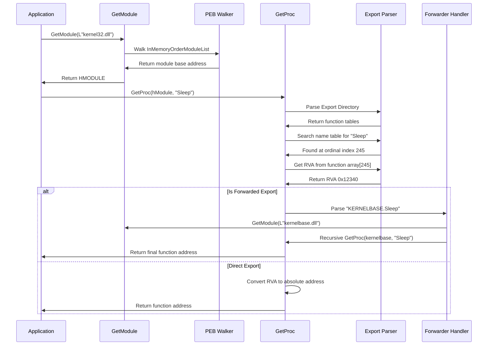
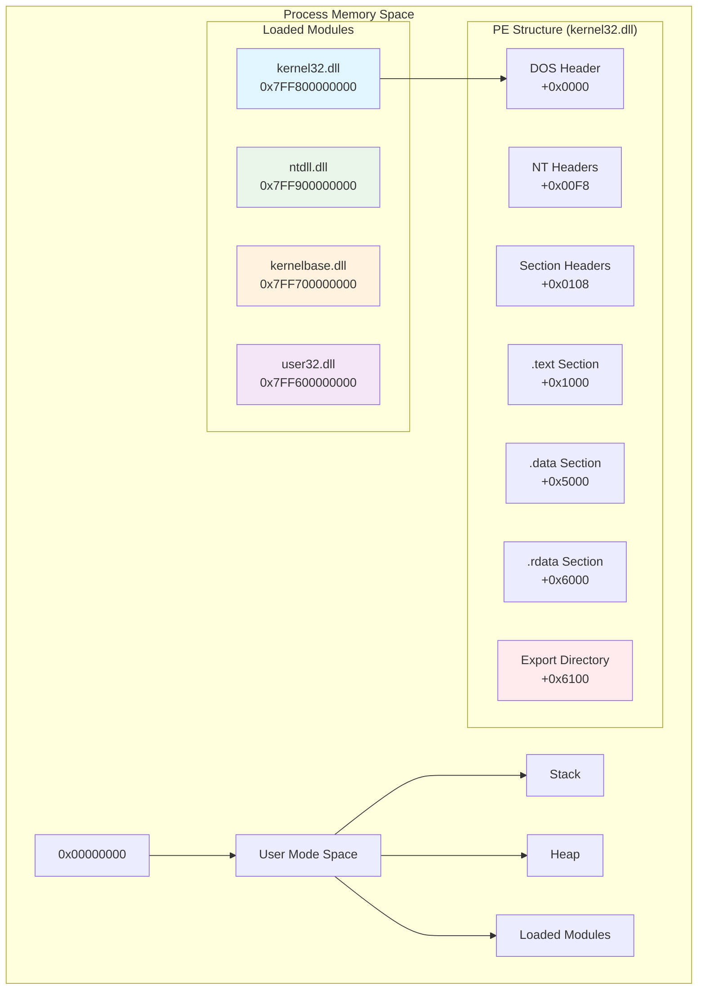
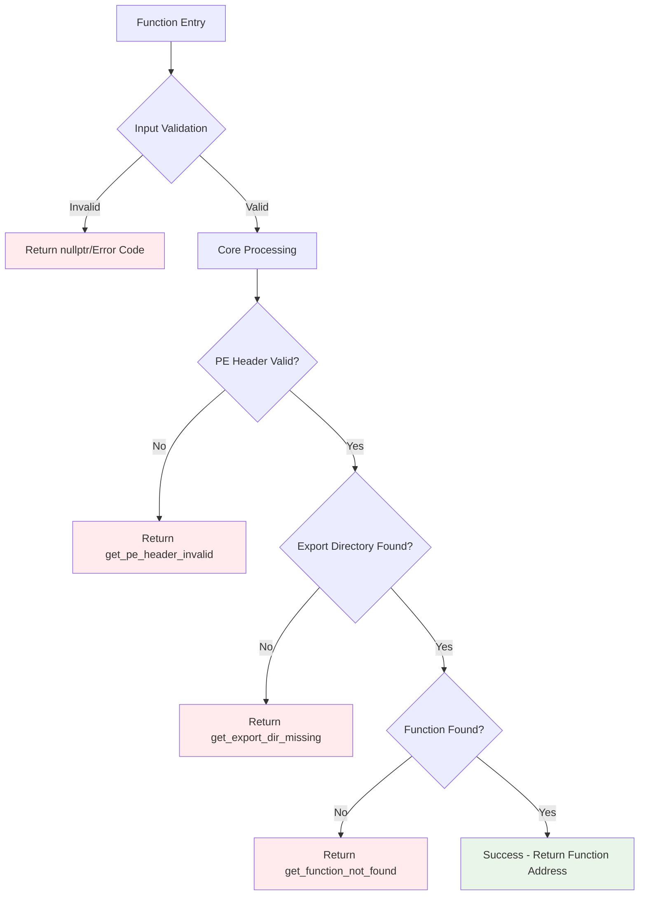
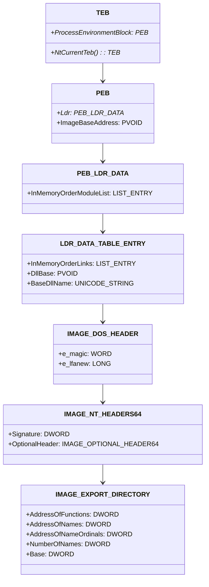
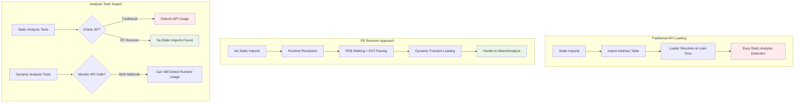
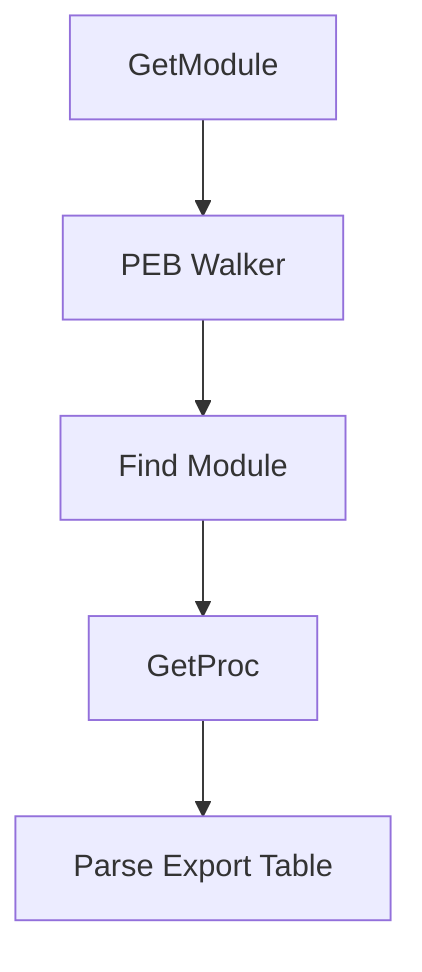

# PE Resolver Documentation - Diagrams

## 1. PEB Walking Structure (GetModule Function)



The `GetModule` function traverses the Process Environment Block (PEB) to locate loaded modules in memory without using traditional Windows APIs.

## 2. PE File Structure Layout



This shows the internal structure of a Windows PE (Portable Executable) file and how the resolver navigates to the Export Address Table (EAT).

## 3. GetProc Function Flow



Complete flow of the `GetProc` function showing validation, searching, and export forwarding handling.

## 4. Export Address Table Structure

```mermaid
graph LR
    A[Export Directory] --> B[AddressOfFunctions]
    A --> C[AddressOfNames]  
    A --> D[AddressOfNameOrdinals]
    
    B --> E[Function RVAs Array]
    E --> E1[RVA 0: CreateFileW]
    E --> E2[RVA 1: ReadFile]
    E --> E3[RVA 2: WriteFile]
    E --> E4[RVA N: ...]
    
    C --> F[Name RVAs Array]
    F --> F1[RVA: "CreateFileW"]
    F --> F2[RVA: "ReadFile"] 
    F --> F3[RVA: "WriteFile"]
    F --> F4[RVA: ...]
    
    D --> G[Ordinal Index Array]
    G --> G1[Index: 0]
    G --> G2[Index: 1]
    G --> G3[Index: 2]
    G --> G4[Index: ...]
    
    F1 -.-> G1
    F2 -.-> G2
    F3 -.-> G3
    G1 -.-> E1
    G2 -.-> E2
    G3 -.-> E3
    
    style A fill:#e8f5e8
    style E fill:#e1f5fe
    style F fill:#fff3e0
    style G fill:#f3e5f5
```

Shows how the three arrays in the Export Address Table work together to resolve function names to addresses.

## 5. Function Resolution Sequence



Timeline showing the interaction between different components during function resolution.

## 6. Memory Layout Visualization



Visual representation of how modules are loaded in process memory and their internal PE structure.

## 7. Function Call Chain Example

```mermaid
graph LR
    A[main()] --> B[GetModule<br/>L"kernel32.dll"]
    B --> C[GetProc<br/>kernel32, "Sleep"]
    C --> D[GetProc<br/>kernel32, "LoadLibraryW"]
    D --> E[LoadLibraryW_<br/>L"user32.dll"]
    E --> F[GetProc<br/>user32, "MessageBoxW"]
    F --> G[Function Pointers<br/>Ready for Use]
    
    style A fill:#e8f5e8
    style G fill:#e1f5fe
```

Example execution flow from your main() function showing the sequence of API resolution.

## 8. Error Handling Flow



Error handling paths and return codes for robust function resolution.

## 9. Data Structure Relationships



UML-style class diagram showing relationships between Windows data structures.

## 10. Security Bypass Visualization



Comparison showing how the PE resolver approach evades static analysis detection.

## Usage Instructions

1. **Save this file** as `DIAGRAMS.md` in your GitHub repository
2. **GitHub will automatically render** all the Mermaid diagrams
3. **Link to sections** in your main README using:
   ```markdown
   See [Function Flow Diagram](DIAGRAMS.md#3-getproc-function-flow) for details.
   ```

## Adding to Your README

You can embed individual diagrams in your main README by copying the specific Mermaid code blocks you need.

### Example Integration:
```markdown
## Architecture Overview

The PE resolver works by walking the PEB structure:



For more detailed diagrams, see [DIAGRAMS.md](DIAGRAMS.md).
```
```
