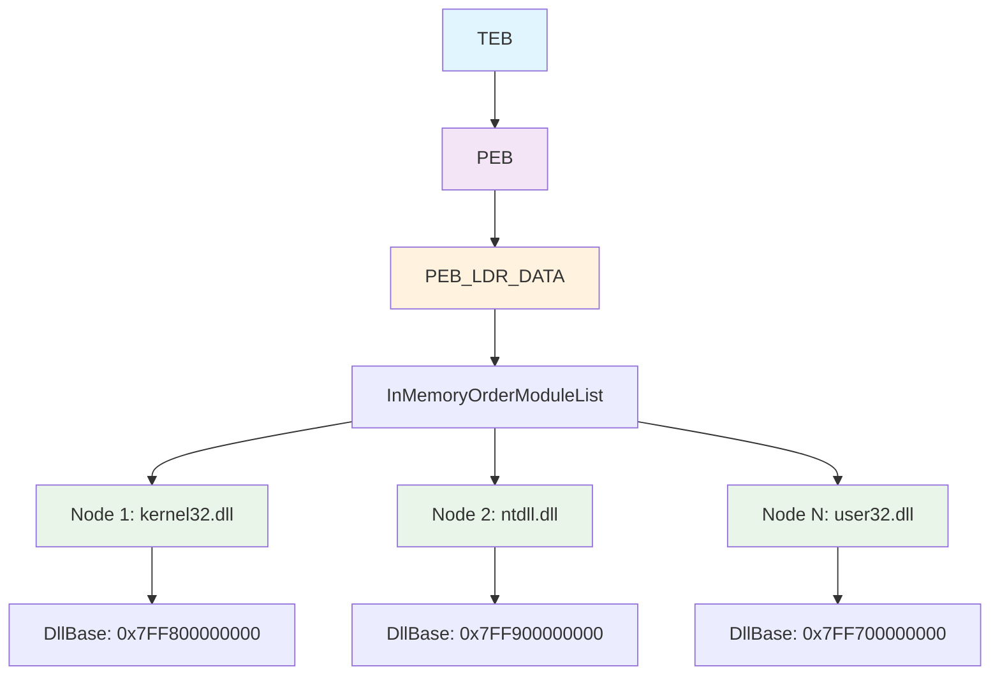
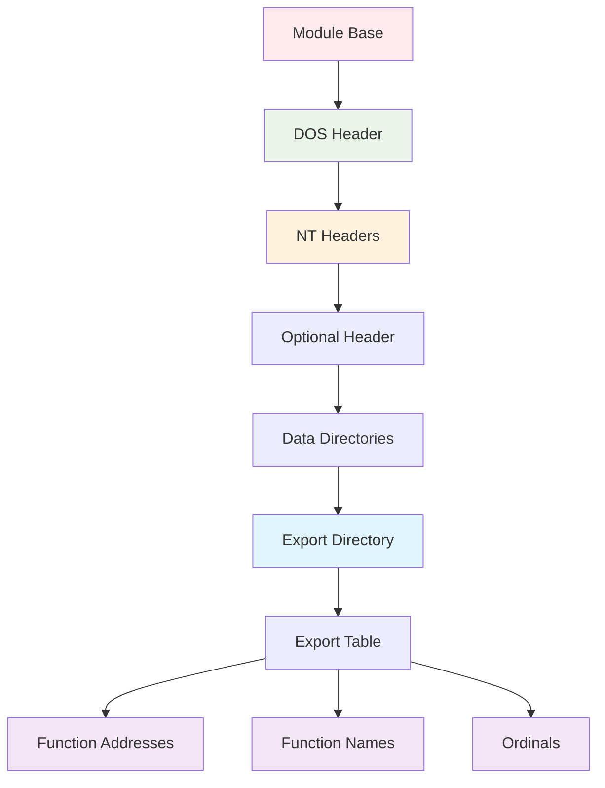
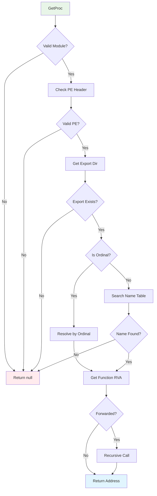
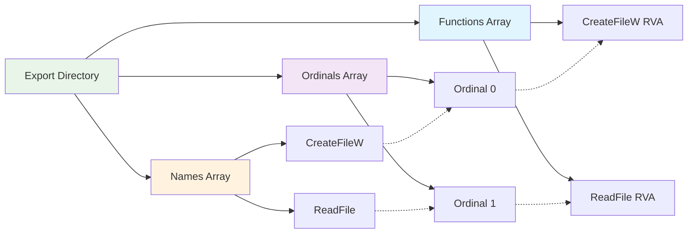
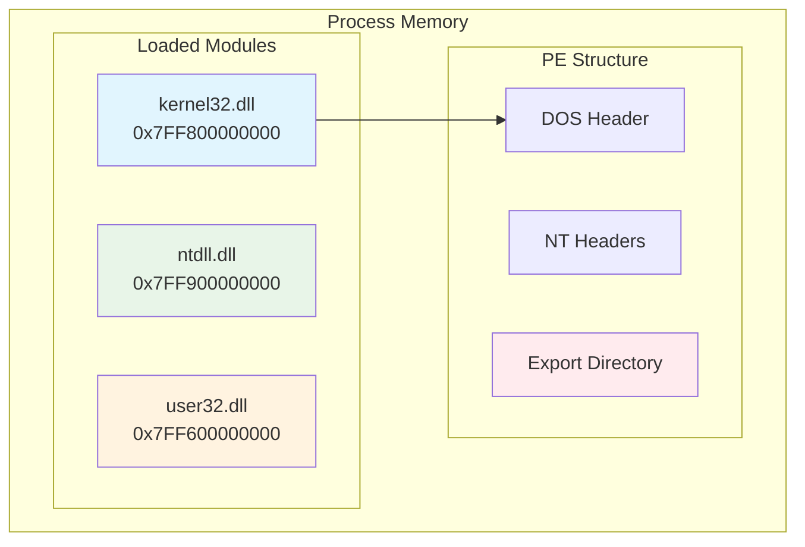
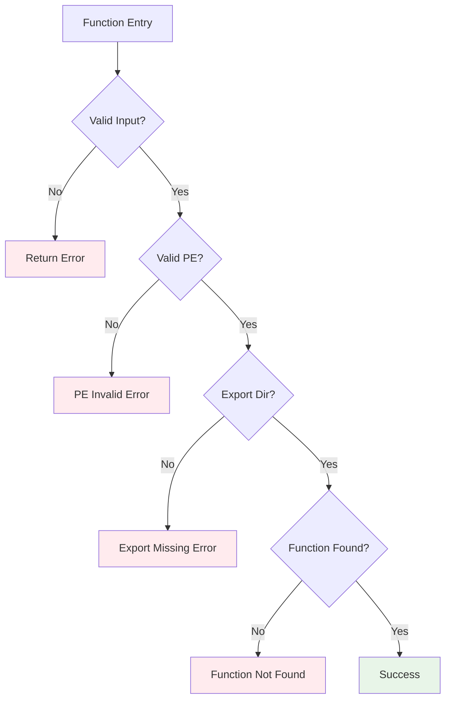
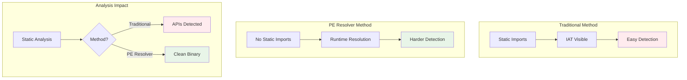
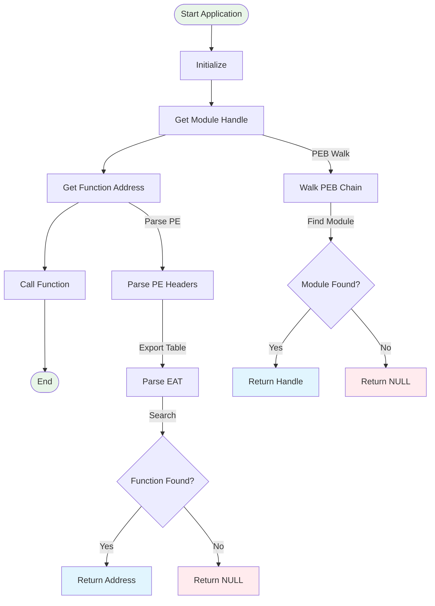

# PE Resolver Documentation - Diagrams

# PE Resolver Documentation - Diagrams

## 1. PEB Walking Structure (GetModule Function)



## 2. PE File Structure Layout



## 3. GetProc Function Flow



## 4. Export Address Table Structure



## 5. Function Resolution Sequence


## 6. Memory Layout Visualization



## 7. Function Call Chain Example


## 8. Error Handling Flow



## 9. Data Structure Relationships


## 10. Security Bypass Comparison



## 11. Complete Process Flow




For detailed diagrams: [View All Diagrams](DIAGRAMS.md)
```

